# OverPy

OverPy is a high level language for the Overwatch workshop with a Python-like syntax, allowing you to code your gamemodes with modern development practices: multiple files, switches, dictionaries, macros, function macros, enums, built-in JS preprocessing...

It contains both a compiler, and a decompiler, to allow you to quickly convert your existing gamemodes to OverPy.

All in-game languages are supported, meaning you do not need to switch your in-game language to English to use it.

The VS Code extension includes syntax highlighting, autocompletion, and documentation:

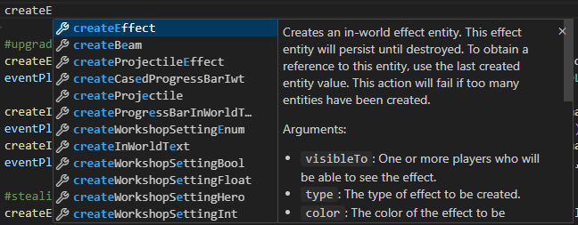
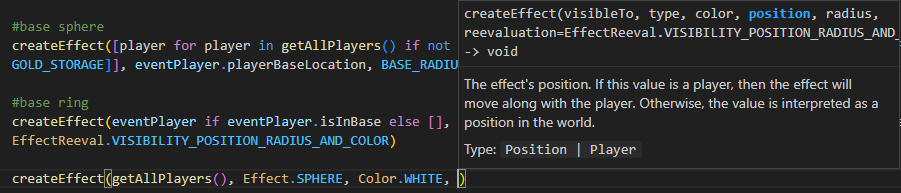

Join the discord for help & feedback: https://workshop.codes/discord

Play around with the demo: https://zezombye.github.io/overpy/demo

Thanks to:

- Arxenix for parsing the workshop documentation (https://github.com/arxenix/owws-documentation/blob/master/workshop.json)
- The Overtool team for providing a way to datamine all translations
- CactusPuppy for converting OverPy to Typescript

# Development

You first need to install the [pnpm package manager](https://pnpm.io/installation). For security reasons, `npm` is not supported.

- Install dependencies: `pnpm install`
- Build in dev and test with the demo: `pnpm run dev`
- Build `out/overpy_standalone.js`: `pnpm run package`
- Build and publish to prod: `pnpm run publish`

# Installation

1. Download and install VS Code: https://code.visualstudio.com/download
2. In the sidebar, click the "Extensions" button, then search for "overpy" and install the extension:

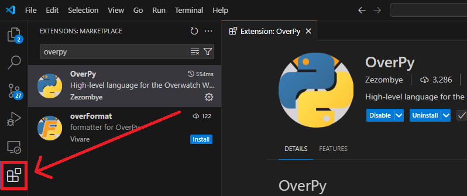

3. Make sure you have [configured Windows to show file extensions](https://www.howtogeek.com/205086/beginner-how-to-make-windows-show-file-extensions/).
4. Create a new file in VS Code (File -> New Text File or Ctrl+N)

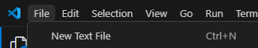

5. Press Ctrl+S to save the untitled file, then save it wherever you want, but make sure it has an ".opy" extension.

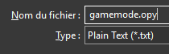

6. The file should now have the OverPy icon and an ".opy" (not .opy.txt) extension.
7. Press Ctrl+Shift+P, type "overpy", then select the "Insert Template" command.

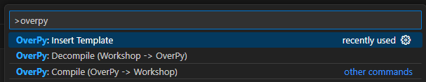

8. You should now have the "OverPy starter pack" in your file. Press Ctrl+S to save it and to compile the starter pack to Workshop.
9. The gamemode is now compiled and can be pasted directly into Overwatch.

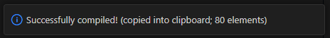

10. If the text language of Overwatch is set to something other than English (not recommended for workshop) and you are unable to paste the gamemode, go to File -> Preferences -> Settings, type "overpy", then select the workshop language.

11. To import an existing gamemode, copy the Workshop code from Overwatch using the "copy settings" button.

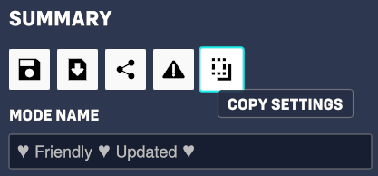

12. Then, in an empty .opy file (refer back to steps 4-5 to create one), press Ctrl+Shift+P, type "overpy", then select "Decompile".

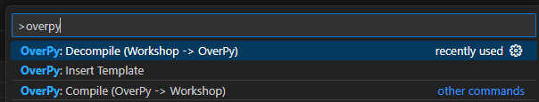

13. Your gamemode is now converted to OverPy and can be compiled by saving the file.

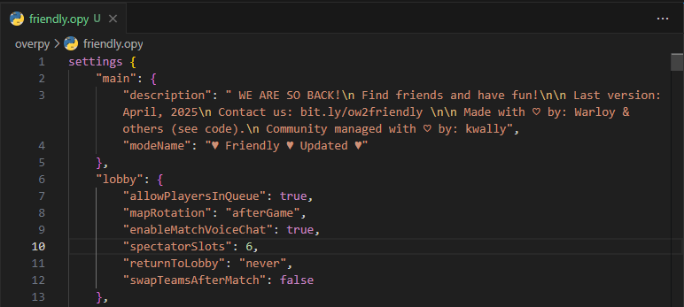

It is not recommended to constantly switch between Workshop and OverPy, as you will not be able to fully use OverPy to its full potential. Once you have decompiled your gamemode, you should not decompile it again.

You may get warnings when compiling; do not ignore them, as they can lead to bugs in your gamemode. If you are sure some warnings can be ignored, see below for how to disable them.

# General Syntax

It is recommended to also decompile one of your existing gamemodes to get a better feel of the OverPy syntax.

```py

# Line comments are made with "#".
# Multiline comments are made with /* */.

# A rule is declared with "rule" followed by the rule name and a colon ":".
# The contents of a rule MUST always be indented.
# The default indentation is 4 spaces.
# Do not change it, as a tab is considered equivalent to 4 spaces.
rule "setup":
    disableInspector() #don't forget to add that to your gamemodes


# Rule metadata is specified with annotations, starting with "@".
# The @Event annotation specifies the event of the rule, same for @Team, @Hero and @Slot.
# The @Condition annotation specifies a rule condition. You can have multiple conditions.
rule "player has spawned":
    @Event eachPlayer
    @Condition eventPlayer.hasSpawned()
    @Condition eventPlayer.A == 1
    @Team 1
    @Hero widowmaker
    @Slot 11
    # You can suppress a warning within the rule with the @SuppressWarnings annotation,
    # followed by the warning names separated by spaces.
    @SuppressWarnings w_player_closest_to_reticle w_wait_9999 #don't do this, it's just for the example

    eventPlayer.B = eventPlayer.getPlayerClosestToReticle(Team.ALL)
    wait(9999)


# A subroutine is declared with the "def" keyword, but follows the same format as a rule.
# Note that due to Workshop limitations, no parameters or return values can be specified.
def teleportPlayerToSpawn():
    @Name "Subroutine: Teleport the player to spawn"
    eventPlayer.teleport(vect(10, 0, 10))


# By default, optimization is enabled, meaning empty rules will not appear in the compilation output.
# To prevent this, you can add the @Delimiter annotation.
rule "---------- Boss fight code ----------":
    @Delimiter
    @Disabled
    @NewPage #adds empty rules to put the rule at the top of a page


# You can declare variables using the globalvar/playervar keywords, followed by an optional index.
# Default variable names (A-Z, AA-DX) do not need to be declared.
globalvar gameStatus 2
playervar score #index is automatically calculated

# You can also directly initialize a variable.
globalvar spawnLocation = vect(10, 0, 10)

rule "functions":
    @Event eachPlayer

    # The vast majority of functions follow these rules:

    # 1. The function name is camelCased.
    # Create Effect() -> createEffect().
    setMatchTime(3600)

    # 2. Function names taking a player, array or string as a first argument are "member functions".
    # Teleport(Event Player, Vector(10,0,10)) -> eventPlayer.teleport(vect(10,0,10))
    eventPlayer.cancelPrimaryAction()

    # 3. Functions to get constants such as Hero(), Map() or Gamemode() are replaced by enums.
    # Map(Hanamura) -> Map.HANAMURA.
    eventPlayer.startForcingHero(Hero.ANA)

    # 4. Operators and some functions have significant syntax changes.
    # You can expand the list below to see all such functions.

    # Some functions also have default values.
    wait() #Equivalent to wait(0.016, Wait.IGNORE_CONDITION)

    # You can also specify individual arguments using the name=value syntax.
    # hudHeader() is a macro for hudText() that only displays the header.
    hudHeader(getAllPlayers(), "Some text", sortOrder=5, color=Color.YELLOW)
    hudHeader(text="Some text")

```

## Function syntax reference

<details>
<summary>List of functions with a significant syntax/name change (click to expand)</summary>

If a function is not in that list, then the name is the English name in camelCase; simply rely on the autocompletion to find it. (Also type a "." to check if it is a member function.)

| Workshop function                      | OverPy function                     |
| -------------------------------------- | ----------------------------------- |
<code>Abort</code>                                       | <code>return</code>
<code>Abort If</code>                                    | <code>if <i>condition</i>:</code><br><code>&nbsp;&nbsp;&nbsp;&nbsp;return</code>
<code>Abort If Condition Is False</code>                 | <code>if not ruleCondition:</code><br><code>&nbsp;&nbsp;&nbsp;&nbsp;return</code>
<code>Abort If Condition Is True</code>                  | <code>if ruleCondition:</code><br><code>&nbsp;&nbsp;&nbsp;&nbsp;return</code>
<code>Absolute Value</code>                              | <code>abs()</code>
<code>Add(A, 3)</code> | <code>A + 3</i></code>
<code>And(A == 2, B == 4)</code> | <code>A == 2 and B == 4</code>
<code>Append To Array(<i>array</i>, <i>value</i>)</code> | <code><i>array</i>.concat(<i>value</i>)</code>
<code>Arccosine In Degrees</code>                        | <code>acosDeg()</code>
<code>Arccosine In Radians</code>                        | <code>acos()</code>
<code>Arcsine In Degrees</code>                          | <code>asinDeg()</code>
<code>Arcsine In Radians</code>                          | <code>asin()</code>
<code>Arctangent In Degrees</code>                       | <code>atan2Deg()</code>
<code>Arctangent In Radians</code>                       | <code>atan2()</code>
<code>Array(<i>a</i>, <i>b</i>, <i>c</i>)</code>          | <code>[<i>a</i>, <i>b</i>, <i>c</i>]</code>
<code>Array Contains(<i>array</i>, <i>value</i>)</code> | <code><i>value</i> in <i>array</i></code>
<code>Array Slice(<i>array</i>, <i>start</i>, <i>count</i>)</code> | <code><i>array</i>.slice(<i>start</i>, <i>count</i>)</code>
<code>Assist Count</code>                                | <code>getNumberOfAssistIds()</code>
<code>Attach Players</code>                              | <code><i>player</i>.attachTo()</code>
<code>Backward</code>                                    | <code>Vector.BACKWARD</code>
<code>Button(Interact)</code>                                      | <code>Button.INTERACT</code>
<code>Call Subroutine(<i>subroutine</i>)</code> | <code><i>subroutine</i>()</code>
<code>Char In String(<i>str</i>, <i>index</i>)</code> | <code><i>str</i>.charAt(<i>index</i>)</code>
<code>Color(White)</code>                                       | <code>Color.WHITE</code>
<code>Compare(<i>a</i>, ==, <i>b</i>)</code>                                     | <code><i>a</i> == <i>b</i></code> (same for !=, &lt;, etc)
<code>Cosine From Degrees</code>                         | <code>cosDeg()</code>
<code>Cosine From Radians</code>                         | <code>cos()</code>
<code>Count Of</code>                                    | <code>len()</code>
<code>Current Array Element</code>                       | See <code>Filtered Array</code>
<code>Current Array Index</code>                         | See <code>Filtered Array</code>
<code>Custom Color</code>                                | <code>rgb()</code>
<code>Custom String("Score: {0}", Score Of(Event Player))</code> | <code>"Score: {}".format(eventPlayer.getScore())</code><br>See [Strings](#strings) for more info.
<code>Damage Modification Count</code>                   | <code>getNumberOfDamageModificationIds()</code>
<code>Damage Over Time Count</code>                      | <code>getNumberOfDamageOverTimeIds()</code>
<code>Detach Players</code>                              | <code><i>player</i>.detach()</code>
<code>Disable Movement Collision With Environment</code> | <code><i>player</i>.disableEnvironmentCollision()</code>
<code>Disable Movement Collision With Players</code>     | <code><i>player</i>.disablePlayerCollision()</code>
<code>Divide(A, 3)</code> | <code>A / 3</code>
<code>Down</code>                                        | <code>Vector.DOWN</code>
<code>Else</code>                                        | <code>else:</code>
<code>Else If</code>                                     | <code>elif:</code>
<code>Empty Array</code>                                 | <code>[]</code>
<code>End</code>                                         | Go back a level of indentation
<code>Entity Count</code>                                | <code>getNumberOfEntityIds()</code>
<code>Evaluate Once</code>                               | <code>evalOnce()</code>
<code>Filtered Array(<i>array</i>, Current Array Element == 2)</code><br><code>Filtered Array(<i>array</i>, Current Array Element == 2 && Current Array Index > 4)</code> | <code>[<i>elem</i> for <i>elem</i> in <i>array</i> if <i>elem</i> == 2]</code><br><code>[<i>elem</i> for <i>elem</i>, <i>index</i> in <i>array</i> if <i>elem</i> == 2 and <i>index</i> > 4]</code><br>The <i>elem</i> and <i>index</i> variables represent <code>Current Array Element</code> and <code>Current Array Index</code> respectively. You can name them however you like.
<code>First Of(<i>array</i>)</code> | <code><i>array</i>[0]</code>
<code>For Global Variable(A, 0, 10, 1)</code><br><code>For Global Variable(A, 1, 10, 1)</code><br><code>For Global Variable(A, 0, 10, 2)</code> | <code>for A in range(10):</code><br><code>for A in range(1, 10):</code><br><code>for A in range(0, 10, 2)</code><br>The step can be omitted if it is 1, and the start can be omitted if it is 0 and step is 1.
<code>For Player Variable(Event Player, A, 1, 10, 2)</code> | <code>for eventPlayer.A in range(1, 10, 2):</code>
<code>Forward</code>                                     | <code>Vector.FORWARD</code>
<code>Game Mode(Assault)</code>                                   | <code>Gamemode.ASSAULT</code>
<code>Global.A</code>                                      | <code>A</code>
<code>Global Variable(A)</code>                             | <code>A</code>
<code>Heal Over Time Count</code>                        | <code>getNumberOfHealingOverTimeIds()</code>
<code>Healing Modification Count</code>                  | <code>getNumberOfHealingModificationIds()</code>
<code>Hero(Ana)</code>                                        | <code>Hero.ANA</code>
<code>Hero Being Duplicated</code>                       | <code><i>player</i>.getHeroOfDuplication()</code>
<code>If(A == 2)</code>                                          | <code>if A == 2:</code>
<code>If-Then-Else(A == 2, 3, 20)</code> | <code>3 if A == 2 else 20</code><br>Note that the if/else operator has a low precedence. This means `B + 3 if A == 2 else 20` will be parsed as `(B + 3) if A == 2 else 20`. It is customary to wrap the if/else operator with parentheses.
<code>Index Of Array Value(<i>array</i>, <i>value</i>)</code> | <code><i>array</i>.index(<i>value</i>)</code>
<code>Index Of String Char(<i>str</i>, <i>char</i>)</code>                        | <code><i>str</i>.strIndex(<i>char</i>)</code>
<code>Is Button Held</code>                              | <code><i>player</i>.isHoldingButton()</code>
<code>Is In Line of Sight</code>                         | <code>isInLoS()</code>
<code>Is Portrait On Fire</code>                         | <code><i>player</i>.isOnFire()</code>
<code>Is True For All(<i>array</i>, Current Array Element == 2)</code> | <code>all([<i>elem</i> == 2 for <i>elem</i> in <i>array</i>])</code>
<code>Is True For Any(<i>array</i>, Current Array Element == 2 && Current Array Index > 4)</code> | <code>any([<i>elem</i> == 2 and <i>idx</i> > 4 for <i>elem</i>, <i>idx</i> in <i>array</i>])</code><br>Also see Filtered Array.
<code>Last Of(<i>array</i>)</code>                                     | <code><i>array</i>.last()</code>
<code>Left</code>                                        | <code>Vector.LEFT</code>
<code>Loop If(A == 2)</code>                                     | <code>if A == 2:</code><br><code>&nbsp;&nbsp;&nbsp;&nbsp;loop()</code>
<code>Loop If Condition Is False</code>                  | <code>if not ruleCondition:</code><br><code>&nbsp;&nbsp;&nbsp;&nbsp;loop()</code>
<code>Loop If Condition Is True</code>                   | <code>if ruleCondition:</code><br><code>&nbsp;&nbsp;&nbsp;&nbsp;loop()</code>
<code>Magnitude Of</code>                                | <code>magnitude()</code>
<code>Map(Workshop Island)</code>                                         | <code>Map.WORKSHOP_ISLAND</code>
<code>Mapped Array(<i>array</i>, Current Array Element + 2)</code><br><code>Mapped Array(<i>array</i>, Current Array Element * Current Array Index)</code> | <code>[<i>elem</i>+2 for <i>elem</i> in <i>array</i>]</code><br><code>[<i>elem</i> * <i>idx</i> for <i>elem</i>,<i>idx</i> in <i>array</i>]</code>
<code>Modify Global Variable(A, Add, 2)</code>                      | <code>A += 2</code>
<code>Modify Global Variable(A, Append To Array, 2)</code>                      | <code>A.append(2)</code>
<code>Modify Global Variable(A, Divide, 2)</code>                      | <code>A /= 2</code>
<code>Modify Global Variable(A, Max, 2)</code>                      | <code>A max= 2</code>
<code>Modify Global Variable(A, Min, 2)</code>                      | <code>A min= 2</code>
<code>Modify Global Variable(A, Modulo, 2)</code>                      | <code>A %= 2</code>
<code>Modify Global Variable(A, Raise To Power, 2)</code>                      | <code>A **= 2</code>
<code>Modify Global Variable(A, Remove From Array By Index, 2)</code>                      | <code>del A[2]</code>
<code>Modify Global Variable(A, Remove From Array By Value, 2)</code>                      | <code>A.remove(2)</code>
<code>Modify Global Variable(A, Subtract, 2)</code>                      | <code>A -= 2</code>
<code>Modify Global Variable At Index(A, 1, Append To Array, 2)</code>             | <code>A[1].append(2)</code>
<code>Modify Global Variable At Index(A, 1, Remove From Array By Index, 2)</code>             | <code>del A[1][2]</code>
<code>Modify Player Score</code>                         | <code><i>player</i>.addToScore()</code>
<code>Modify Player Variable(Event Player, A, Max, 2)</code> | <code>eventPlayer.A max= 2</code>
<code>Modify Player Variable At Index(Event Player, A, 1, Remove From Array By Value, 2)</code> | <code>eventPlayer.A[1].remove(2)</code>
<code>Modify Team Score</code>                           | <code>addToTeamScore()</code>
<code>Modulo(A, B)</code>                                      | <code>A % B</code>
<code>Move Player to Team</code>                         | <code>moveToTeam()</code>
<code>Multiply(A, B)</code>                                    | <code>A * B</code>
<code>Not(<i>a</i>)</code>                                         | <code>not <i>a</i></code>
<code>Number(1234)</code>                                      | <code>1234</code>
<code>Objective Index</code>                             | <code>getCurrentObjective()</code>
<code>Objective Position</code>                          | <code>getObjectivePosition()</code>
<code>Opposite Team Of(Team Of(Event Player))</code>                            | <code>getOppositeTeam(eventPlayer.getTeam())</code><br>Or for a player: `eventPlayer.getOppositeTeam()`
<code>Or(A == 2, B == 4)</code>                                          | <code>A == 2 or B == 4</code>
<code>Player Carrying Flag</code>                        | <code>getFlagCarrier()</code>
<code>Player Variable(Event Player, A)</code>                             | <code>eventPlayer.A</code>
<code>Press Button</code>                                | <code><i>player</i>.forceButtonPress()</code>
<code>Raise To Power(A, 2)</code>                              | <code>A ** 2</code>
<code>Random Integer</code>                              | <code>random.randint()</code>
<code>Random Real</code>                                 | <code>random.uniform()</code>
<code>Random Value In Array</code>                       | <code>random.choice()</code>
<code>Randomized Array</code>                            | <code>random.shuffle()</code>
<code>Raycast Hit Normal(<i>start</i>, <i>end</i>, <i>include</i>, <i>exclude</i>, <i>includePlayerObjects</i>)</code> | <code>raycast(<i>start</i>, <i>end</i>, <i>include</i>, <i>exclude</i>, <i>includePlayersObjects</i>).getNormal()</code>
<code>Raycast Hit Player(<i>start</i>, <i>end</i>, <i>include</i>, <i>exclude</i>, <i>includePlayerObjects</i>)</code> | <code>raycast(<i>start</i>, <i>end</i>, <i>include</i>, <i>exclude</i>, <i>includePlayersObjects</i>).getPlayerHit()</code>
<code>Raycast Hit Position(<i>start</i>, <i>end</i>, <i>include</i>, <i>exclude</i>, <i>includePlayerObjects</i>)</code> | <code>raycast(<i>start</i>, <i>end</i>, <i>include</i>, <i>exclude</i>, <i>includePlayersObjects</i>).getHitPosition()</code>
<code>Remove From Array(<i>array</i>, 2)</code>                           | <code><i>array</i>.exclude(2)</code>
<code>Remove Player</code>                               | <code><i>player</i>.removeFromGame()</code>
<code>Right</code>                                       | <code>Vector.RIGHT</code>
<code>Round To Integer(A, Up)</code> | <code>ceil(A)</code>
<code>Round To Integer(A, Down)</code> | <code>floor(A)</code>
<code>Round To Integer(A, To Nearest)</code> | <code>round(A)</code>
<code>Set Environment Credit Player</code>               | <code><i>player</i>.setEnvironmentalKillCreditor()</code>
<code>Set Global Variable(A, 2)</code>                         | <code>A = 2</code>
<code>Set Global Variable At Index(A, 1, 2)</code>                | <code>A[1] = 2</code>
<code>Set Player Variable(Event Player, A, 2)</code>                         | <code>eventPlayer.A = 2</code>
<code>Set Player Variable At Index(Event Player, A, 1, 2)</code>                | <code>eventPlayer.A[1] = 2</code>
<code>Sine From Degrees</code>                           | <code>sinDeg()</code>
<code>Sine From Radians</code>                           | <code>sin()</code>
<code>Skip(A + 3)</code>                                        | <code>goto loc+A+3</code>
<code>Skip(2)</code><br><code>A = 1</code><br><code>B = 2</code><br><code>C = 3</code> | <code>goto <i>label</i></code><br><code>A = 1</code><br><code>B = 2</code><br><code><i>label</i>:</code><br><code>C = 3</code><br>If the argument of the Skip() action is a number, you can instead specify a label within the rule (followed by a colon ":") and OverPy will automatically calculate how many actions to jump.
<code>Skip If(A == 2, 4)</code>                                     | <code>if A == 2:<br>&nbsp;&nbsp;&nbsp;&nbsp;goto <i>label</i></code>
<code>Sorted Array(<i>array</i>, Current Array Element.score</i>)</code> | <code>sorted(<i>array</i>, key=lambda <i>elem</i>: <i>elem</i>.score)</code>
<code>Sorted Array(<i>array</i>, -1 * Current Array Index</i>)</code> | <code>sorted(<i>array</i>, key=lambda elem, <i>idx</i>: -idx)</code><br>Or in this specific case: <code><i>array</i>.reverse()</code><br>The `elem` and `idx` variables represent the `Current Array Element` and `Current Array Index` values respectively. You can name them however you like.
<code>Square Root</code>                                 | <code>sqrt()</code>
<code>Start Assist</code>                                | <code><i>player</i>.startGrantingAssistFor()</code>
<code>Start Forcing Dummy Bot Name</code>                | <code><i>player</i>.startForcingName()</code>
<code>Start Holding Button</code>                        | <code><i>player</i>.startForcingButton()</code>
<code>Start Modifying Hero Voice Lines</code>            | <code><i>player</i>.startModifyingVoicelinePitch()</code>
<code>Start Rule(<i>subroutine</i>, <i>behavior</i>)</code> | <code>async(<i>subroutine</i>, <i>behavior</i>)</code>
<code>Start Scaling Player</code>                        | <code><i>player</i>.startScalingSize()</code>
<code>Stop Holding Button</code>                         | <code><i>player</i>.stopForcingButton()</code>
<code>Stop Modifying Hero Voice Lines</code>             | <code><i>player</i>.stopModifyingVoicelinePitch()</code>
<code>String("Hello")</code>                                      | <code>l"Hello"</code><br>Note: those are "localized strings" and should never be used. Use `Custom String` instead (don't prefix strings by "l").
<code>String Contains</code>                             | <code>strContains()</code>
<code>String Length</code>                               | <code>strLen()</code>
<code>String Replace(Custom String("abc"), Custom String("a"), Custom String("d"))</code>                              | <code>"abc".replace("a", "d")</code>
<code>String Slice(Custom String("abc"), 1, 2)</code>                                | <code>"abc".substring(1, 2)</code>
<code>String Split(Custom String("abc"), Custom String("b"))</code>                                | <code>"abc".split("b")</code>
<code>Subtract(A, 2)</code>                                    | <code>A - 2</code>
<code>Tangent From Degrees</code>                        | <code>tanDeg()</code>
<code>Tangent From Radians</code>                        | <code>tan()</code>
<code>Team(Team 1)</code>                                        | <code>Team.1</code>
<code>Text Count</code>                                  | <code>getNumberOfTextIds()</code>
<code>Up</code>                                          | <code>Vector.UP</code>
<code>Value In Array(A, 3)</code>                              | <code>A[3]</code>
<code>Vector</code>                                      | <code>vect()</code>
<code>Weapon</code>                                      | <code><i>player</i>.getCurrentWeapon()</code>
<code>While(A == 2)</code>                                       | <code>while A == 2:</code>
<code>X Component Of(<i>vector</i>)</code>                              | <code><i>vector</i>.x</code>
<code>Y Component Of(<i>vector</i>)</code>                              | <code><i>vector</i>.y</code>
<code>Z Component Of(<i>vector</i>)</code>                              | <code><i>vector</i>.z</code>

</details>

## Custom game settings

OverPy supports including custom game settings, using the `settings` keyword. The settings are parsed with OverPy's parser, meaning you can do things such as:

```py
macro VERSION = "1.4.3"
macro DEBUG = false
macro CLIP_SIZE_MULTIPLIER = 2
enum HeroUltModifiers:
    ASHE = 400

settings {
    /* comment */
    "main": {
        "modeName": w"Tower Meifense",
        "description": f"Tower Meifense by Zezombye v{VERSION}",
    },
    "gamemodes": {
        "general": {
            "respawnTime%": 50 if DEBUG else 100,
        }
    },
    "heroes": {
        "allTeams": {
            "ashe": {
                "ammoClipSize%": 100 * CLIP_SIZE_MULTIPLIER,
                "ultDuration%": HeroUltModifiers.ASHE
            },
        }
    }
}
```

Note that every value has to eventually resolve to a dict/array/string/number/boolean through the optimizer (you can't do `200 * A` where `A` is a variable).

There are quite a lot of changes regarding the syntax, and it is recommended that you edit settings within Overwatch, then use the decompile command to convert to OverPy.

You can also put the settings in a .json file and then import it with `settings "gamesettings.opy.json"`. This has the advantage of adding autocompletion (if ending with .opy.json), although it will display syntax errors if it doesn't perfectly conform to the JSON syntax (trailing comma, comment, etc).

Extensions are activated using the `#!extensions` compiler directive.

# Control flow

## If, Elif, Else

An if/elif/else statement is simply represented by the following structure:

```python
if A == 1:
    B = 2
elif A == 2:
    B = 3
elif A == 3:
    B = 4
else:
    B = 5
```

## While loop

A while loop is represented by the following structure:

```python
while A == 1:
    B = 2
    wait()
```

It compiles to the workshop's `While` instruction.

## For loop

A for loop is represented by the following structure:
```python
globalvar i
rule "for loop":
    for i in range(1, 5, 2):
        B.append(i)
    #B = [1,3,5]
```

Note that the `range(start, stop, step)` function, that can only be used here, has other forms:

```python
for i in range(1,5) -> for i in range(1,5,1)
for i in range(5) -> for i in range(0,5,1)
```

As such, you can use the `range(start, stop)` and `range(stop)` signatures.

## Gotos

Although not recommended to use, gotos can be used in conjunction with a label. They are the equivalent of the Workshop's `Skip` instruction.

For example:

```python
if A == 4:
   goto lbl_0
B = 5
lbl_0:
C = 6
```

Labels are declared on their own line, and must include a colon at the end (but no additional indentation).

Due to the limitations of the workshop, labels must be in the same rule as the `goto` instruction, and cannot be before it.

Additionally, dynamic gotos can be specified using the special keyword `loc`:
```python
goto loc+A
```

This is however not recommended and can lead to very confusing code; you should consider using switches instead.

These statements are compiled to `Skip` or `Skip If` instructions.

OverPy guarantees a fixed amount of instructions:
- Each logical line counts for one instruction, except for the `switch` statement which counts for 2 instructions.
- Each unindent counts for one instruction.

This is true regardless of optimizations.

# Strings

Strings are written with single or double quotes, using the backslash character to escape: `"string \"with quotes\"\nand a newline"`.

To concatenate strings, the `.format()` function must be used with `{}` or `{number}` placeholders, such as `"You have {} money and deal {} damage".format(eventPlayer.money, eventPlayer.damage)`.

The Workshop applies a limit of 128 characters and 3 placeholders per string. OverPy automatically splits a string if it goes beyond that limit; you can therefore write your strings with as many characters and as many placeholders as you want.

Successive strings are concatenated: `"string1""string2"` will resolve to `"string1string2"`.

The escape sequence `\n` can be used to make a newline. Strings are also multiline by default (no need for triple quotes), therefore a literal newline within a string will be compiled as a `\n`.

The escape sequences `\xHH` (byte escape) and `\uHHHH` (unicode escape) are also supported, where `H` is an hexadecimal digit. For example, `"\u3000"` will output a fullwidth space.

String entities, using the escape sequence `\&`, can also be used to not have to look up unicode characters: `"\&black_square;"` is the same as `"■"`.

The escape sequences `\t`, `\r`, and `\z` map respectively to a tab, a carriage return, and a zero-width space.

## String modifiers

String modifiers are placed just before the string, such as `w"fullwidth string"`. There are currently 6 string modifiers:

- The `l` string modifier specifies a localized string (`String` function in the workshop). Localized strings are not recommended as they are limited to a specific subset of predefined strings. They are only included for legacy gamemodes.
- The `w` string modifier makes the string fullwidth.
- The `b` string modifier forces, when possible, the use of the "big letters" font (Blizzard Global font).
- The `c` string modifier makes the string case-sensitive, using special latin characters that are not uppercased. It however shows diacritics above most letters, and only works with the latin alphabet.
- The `t` string modifier specifies that the string should be included in translations (see [translations](#translations).)
- The `f` string modifier allows using inline formatters instead of the `.format()` function, such as `f"You have {eventPlayer.money} money and deal {eventPlayer.damage} damage"`. A formatter cannot have a "}" or the same quote as the source string inside it.

In case of string concatenation, string modifiers can only be used on the first string, and will apply to the whole string: `f"string" "{1+2}"` will resolve to `"string3"`.

## Tags

The `#!setupTags` directive can be used to use textures and colors in strings.

If this directive is used, OverPy will automatically generate the rule to obtain an unsanitized "<" character, and automatically replace it in strings if they are the start of a tag.

For color, use the &lt;fgRRGGBBAA> tag, where RR/GG/BB are the hex color value, and AA is the hex transparency value (00 = transparent, FF = opaque).

Example: `print('<fgFF0000FF>Red text</fg>')`

For textures, use the &lt;TX> standalone tag, with the texture id as seen in https://workshop.codes/wiki/articles/tx-reference-sheet.

Example: `print('<TXC0000000002DD21>')` will display the mouse cursor texture.

Additionally, you can use the `Texture` enum and OverPy will automatically optimize it.
For example: `"Mouse cursor texture: {}".format(Texture.MOUSE_CURSOR)`

OverPy will also replace `'<tx1234>'` to the correct full texture id, but only if the entire tag is inside a string (`'<tx{}>'.format(id)` will not work, but `'<tx{}>'.format(1234)` will).


# Compiler options

Compiler options begin with the `#!` operator, not indented.

## #!include

Inserts the text of the specified file. The file path can be relative; if so, it is relative to the file with the `#!include` directive. For example:

```c
#!include "heroes/zenyatta.opy"

/* includes a file in the parent directory (".." is the parent directory) */
#!include "../main.opy"

/* will include all files in the "heroes" directory */
#!include "heroes/"
```

## #!mainFile

Specifies an .opy file as the main file (implying the current file is a module). This directive MUST be placed at the very beginning of the file. For example:

```hs
#!mainFile "../main.opy"
```

This is so that you can compile your gamemode from any file and OverPy knows the starting point to use.

## #!suppressWarnings

Suppresses the specified warnings globally across the program. Warnings must be separated by a space. Example:

```hs
#!suppressWarnings w_type_check w_unsuitable_event
```

## Optimizations

By default, OverPy automatically optimizes gamemodes for speed. This means useless code is removed, calculations are done when possible, and function patterns are replaced with builtin functions.

For example:

- `A = A * 1 + 0` will not be included, as multiplying by 1 and adding 0 does nothing, and it is an assignment to itself.
- `A = 10*10+20` will compile to `A = 120`.
- `not eventPlayer.isDead()` will compile to `eventPlayer.isAlive()`.

You can check [here](https://github.com/Zezombye/overpy/issues/33) for a list of optimizations.

The `#!disableOptimizations` directive can be used to disable all optimizations done by the compiler. Should be only used for debugging, if you suspect that OverPy has bugs in its optimizations, or if you want to generate an unoptimize instruction for some reason.

The `#!optimizeForSize` directive prioritizes lowering the number of elements over optimizing the runtime (see [here](https://github.com/Zezombye/overpy/issues/238) for a list of optimizations).

The `#!optimizeStrict` directive disables some optimizations that may cause issues in extreme cases of type conversion. For example:

- A*0 can return vect(0,0,0) instead of 0
- A+0 and A*1 can return 0 if A is not a number
- A or true should return A instead of true if A is truthy

Those optimizations (and others) will be disabled so that the behavior of the gamemode will not be altered.

This directive is added by default upon decompilation. Only remove it if you are sure that your gamemode does not rely on type conversion tricks. It is recommended to use a website such as http://diffchecker.com to compare the differences in the output when enabling/disabling this directive.

All 3 of these directives are only effective in the current block scope (indentation level) once they are declared, and can be cancelled by `#!enableOptimizations`, `#!disableOptimizeForSize` and `#!disableOptimizeStrict` respectively. For example:

```py
rule "default: optimizations, no optimize for size, no optimize strict"
    A = B+0 #will be optimized
    if A:
        #!disableOptimizations
        B = B+0 #will not be optimized
    C = B+0 #will be optimized
    #!optimizeForSize
    D = B+1 #B + true

#!optimizeStrict
#All subsequent rules will have strict optimization enabled
rule "optimize strict, no optimize for size":
    E = B*1 #will not be optimized
```

## Replacements

Several compiler options are available to automatically replace some constants, in order to save elements:

```hs
#!replaceTeam1ByControlScoringTeam
#!replace0ByCapturePercentage
#!replace0ByPayloadProgressPercentage
#!replace0ByIsMatchComplete
#!replace1ByMatchRound
```

These replacements should only be used if the requirements for the replacement are met. They are detailed in the autocomplete description of each compiler option.

Size optimizations must be enabled for these replacements to work (with `#!optimizeForSize`).

# Preprocessing

Preprocessing is an important part of OverPy and allows extending its power way beyond the limitations of the workshop.

## Macros

Use the `macro` keyword to declare a macro, which is an inline function or constant. For example:

```python
macro BOSS_HP = 1000 + getNumberOfPlayers() * 300

macro add(a, b):
    a + b

rule "":
    A = add(C, D) #A = C + D
    B = BOSS_HP #B = 1000 + getNumberOfPlayers() * 300
```

Note that the replacement is done in the AST, meaning the order of operations will be as expected. For example, `BOSS_HP * 200` will be equivalent to `(1000 + getNumberOfPlayers() * 300) * 200`.

You can also declare member macros, where the member is referenced with `self`. For example:

```python
macro Vector.sum = self.x + self.y

macro Player.setPowerLevel(powerLevel):
    self.setMaxHealth(powerLevel*300)
    self.setDamageDealt(100+powerLevel*20)

#"self" is replaced by the member (here hostPlayer / powerLevel)
rule "power level":
    powerLevel = vect(1, 4.5, 2)

    hostPlayer.setPowerLevel(powerLevel.sum)
    #equivalent to:
    hostPlayer.setMaxHealth((powerLevel.x + powerLevel.y) * 300)
    hostPlayer.setDamageDealt(100 + (powerLevel.x + powerLevel.y) * 20)

```

Default parameters can also be specified, and just like normal functions, you can use keyword arguments:

```python
macro Player.setPowerLevel(powerLevel=1, damageDealt=null):
    self.setMaxHealth(powerLevel*200)
    self.setDamageDealt(damageDealt or powerLevel*2)

rule "":
    hostPlayer.setPowerLevel(damageDealt=3)
```

## #!define

The `#!define` directive declares a text-based macro, meaning the replacement is literal.

For example, given this function:

```hs
#!define sum(a,b) a+b
```

then `sum(3, 4) * 3` will be resolved as `3 + 4 * 3` and `sum(3, 4 if A else 3)` will be resolved as `3 + 4 if A else 3`.

This macro should be declared instead as `#!define sum(a,b) ((a)+(b))`: parentheses around the whole macro definition, and around each argument.

This problem does not occur with `macro`, which is why you should always use them unless you absolutely need `#!define` (you most likely don't).

## Javascript macros

You can do script macros with `#!define` and the special `__script__` function. For example:

```hs
#!define addFive(x) __script__("addfive.js")
```

The content of `addfive.js` is simply `x+5` (no `return`!)

For the technical details:

- Arguments are automatically inserted into the script (in this case, `var x = 123;` would be inserted at the top of the script)
- A `vect()` function is automatically inserted, so that `vect(1,2,3)` returns an object with the correct x, y, and z properties and `toString()` function
- The `Map`, `Gamemode`, `Hero`, `Color`, `Team` and `Button` enums can also be used (`Map.KANEZAKA` will return `"Map.KANEZAKA"`)
- The script is then evaluated using a JavaScript interpreter

## Enums

Enums can be declared to avoid manually declaring several macros:

```java
enum GameStatus:
    GAME_NOT_STARTED = 1
    GAME_IN_PROGRESS
    GAME_FINISHED

enum Team:
    HUMANS = Team.2
    ZOMBIES = Team.1

rule "Kill zombies when game has finished":
    @Condition gameStatus == GameStatus.GAME_FINISHED
    kill(getPlayers(Team.ZOMBIES), null)
```

If an enum member is not given a value, it will take the previous value plus 1 (or 0 if it is the first value). You can also extend existing enums, such as the `Team` enum in this example.

You can use `len(GameStatus)` to have the amount of values in the enum and `GameStatus.toArray()` to get an array of the values. This is useful to iterate on the values.

Note that enum members are inlined, so if you use a value such as `getAllPlayers()` that changes during a game, the value of the enum will also change.

# Advanced constructs

## Switches

Switches are a good way to transform an if/elif/else chain into something more optimized:

```python
switch A:
    case Hero.ANA:
        B = 2
        break
    case Hero.ASHE:
        B = 3
        break
    default:
        B = 4
```

This is equivalent to:
```python
if A == Hero.ANA:
    B = 2
elif A == Hero.ASHE:
    B = 3
else:
    B = 4
```

However, the switch statement has the advantage of not recalculating `A`.

Keep in mind that fallthrough is enabled, so if you don't have a `break` instruction, the execution continues to the next `case` statement.

## Dictionaries

In the above case, we always set the same variable. Therefore, a dictionary can be used:

```python
B = {
    0: 4,
    Hero.ANA: 2,
    Hero.ASHE: 3,
}[A]
```

If the key is not found in the dictionary, `null` will be returned. However, you can specify a `default` key for a default value.

This dictionary is internally converted to:
```python
B = [4, 2, 3][[0, Hero.ANA, Hero.ASHE].index(A)]
```

Therefore, a dictionary cannot be declared alone; it must always be accessed.

# Built-in macros

OverPy includes some built-in macros for commonly used patterns.

## Lowercase

The `createCasedProgressBarIwt` function can be used to overlay multiple texts and display pixel-perfect lowercase text. It can however only be used with the Blizzard Global font.

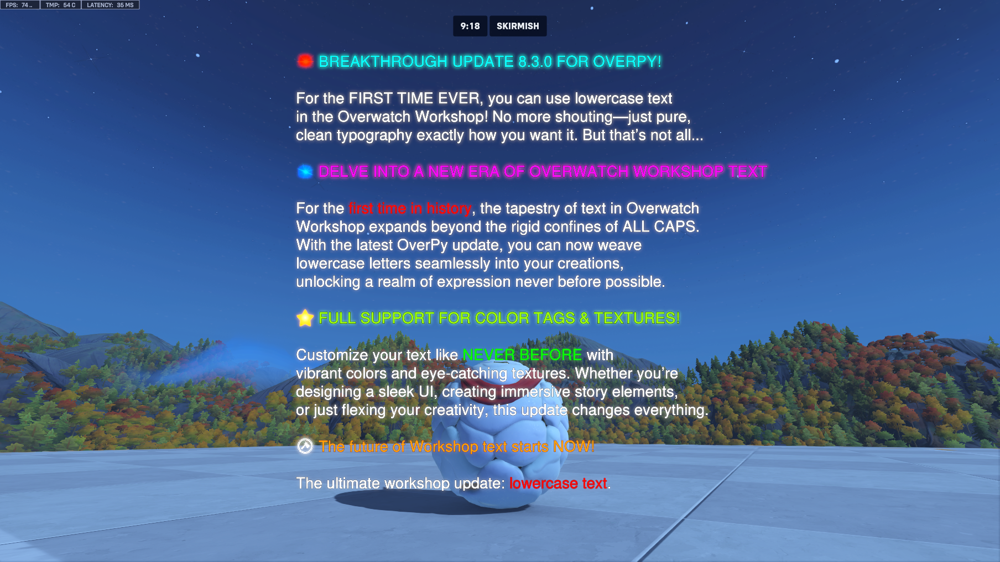

## spacesForString

Returns a string made of spaces that is the same length as the provided string. The provided string must be a literal string.

**NOTE**: The displayed string MUST be in the Blizzard Global font (use the 'b' string modifier on the final string, unless using a progress bar). **The casing of the string is also respected**.

The `spacesForLength` and `strVisualLength` macros can also be used. `spacesForString` is the combination of these two.

This is useful to do alignment tricks. For example, the following code displays a key:value attribute list:

```py
#We use strVisualLength("M")*20 to specify a string that is longer than the longest key/value.
#!define dictLine(key, value) "{}{}{}{}".format(spacesForLength(strVisualLength("M")*20 - strVisualLength(key)), (key), (value), spacesForLength(strVisualLength("M")*20 - strVisualLength(value)))
rule "iwt":
    createProgressBarInWorldText(text=b" \n\n\n\n\n\n\n\n\n\n\n\n\n\n\n\n\n\n{}\n{}\n{}".format(
        #If not using createCasedProgressBarIwt then you have to put the strings in uppercase
        dictLine("ABILITY 1: ", "KILLAURA"),
        dictLine("ABILITY 2: ", "WALLHACK"),
        dictLine("ULTIMATE: ", "CRASH THE SERVER")
    ), position=vect(0,0,0), scale=2)
```

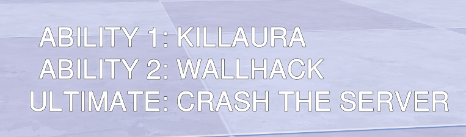

## ruleCondition

The `ruleCondition` value compiles to all the conditions of the rule, joined with `and`.

This is mostly useful in `waitUntil`, so you can do the following:

```py
rule "":
    @Event eachPlayer
    @Condition ...
    @Condition ...
    @Condition ...
    eventPlayer.startHealingOverTime(null, Math.INFINITY, 30)
    eventPlayer.hotId = getLastHealingOverTimeId()
    waitUntil(not ruleCondition)
    #cleanup
    stopHealingOverTime(eventPlayer.hotId)
```

## String compression

You can use the `compressed()` function to store a large array of numbers or vectors.

For example:

```py
mapData = compressed([vect(-65.048, -18.007, -80.036), vect(0.92, 12.58, -18.32), vect(194.041, 6.128, -74.097), ...])
```

OverPy will store the array in a string and automatically decompress it, which takes much fewer elements.

For more control over the compression (eg if you have separate arrays to compress), you can use the `compress` and `decompressNumbers`/`decompressVectors` functions.

## splitDictArray

Maps an array of dictionaries to variables. For example:

```python
splitDictArray({
    hero: waveHeroes,
    length: waveLengths
}, [
    {hero: Hero.ANA, length: 3},
    {length: 8, hero: Hero.SOLDIER},
    {hero: Hero.HAMMOND}
])
```

Will yield the following:

```python
waveHeroes = [Hero.ANA, Hero.SOLDIER, Hero.HAMMOND]
waveLengths = [3, 8, null]
```

If the third argument is specified and set to `true`, string compression is automatically used for number and vector arrays.

## 2d/3d array assignment

The Workshop only allows you to directly assign to a 1d array, but thanks to Mira, assignments to 2d/3d arrays are supported:

- `array[i][j] = value` will be compiled to `array[i] = array[i].slice(0, j).concat([value]).concat(array[i].slice(j+1))`
- `array[i][j][k] = value` will be compiled to `array[i] = array[i].slice(0, j).concat([array[i][j].slice(0, k).concat([value]).concat(array[i][j].slice(k+1))]).concat(array[i].slice(j+1))`


## Constants

The `Math` enum contains useful constants, such as `Math.INFINITY` and `Math.FUCKTON_OF_NEWLINES`. See the autocompletion for more info.

## Other functions

| Function | Description |
|----------|-------------|
| `Player.getOppositeTeam()` | Returns the opposite team of a player. |
| `Player.getEffectiveHero()` | Returns the hero the player is duplicating (if using Echo ultimate) or the normal hero of a player. |
| `getSign()` | Returns the sign of a number (-1, 0 or 1). |
| `hudHeader()`, `hudSubheader()`, `hudSubtext()` | Built-in macros for `hudText()` to reduce the number of arguments. You can specify `HudPosition.ACTUALLY_LEFT` to fix the bug where HUDs are centered relative to each other, but you have to specify it on each of the left HUDs. |
| `lineIntersectsSphere()` | Determines if a line intersects a sphere. Can be used to check if a player is looking at a specific point. |
| `print()` | Creates an orange HUD text for quick debugging of a value. |
| `debug()` | You will likely want to use this rather than `print()`. This function displays the value and also displays the arguments passed to it, so `debug(A+2)` will display `A + 2 = 4` instead of just `4`. |
| `Array.reverse()` | Reverses the array. |
| `Array.unique()` | Removes duplicates from the array. |
| `timeToString()` | Converts a time (in seconds) to a H:MM:SS string. For example, `timeToString(3600+120+37.65)` will return `1:02:37.65`. |
| `arrayToString()` | Converts an array to a string (otherwise, only the first element is displayed). |
| `buttonToString()` | A better version of `Input Binding String()` which automatically adds brackets (but not if the button is a texture) and replaces LSHIFT/LCONTROL/LALT by SHIFT/CTRL/ALT. |
| `hsl()` | Specifies a color in HSL format. |
| `log()` | Calculates the natural logarithm of a given number. |

Feel free to open an issue if you'd like an additional macro to be added.

# Translations

Use the `#!translations` directive to setup the translation system. Arguments are the language codes separated by spaces. For example:

`#!translations en fr es zh_cn`

Only the `es_mx`, `es_es`, `zh_cn` and `zh_tw` languages can be specified fully. For the rest, you can only specify the first two letters. The valid languages are `de`,`en`,`es`,`es_es`,`es_mx`,`fr`,`it`,`ja`,`ko`,`pl`,`pt`,`ru`,`th`,`tr`,`zh`,`zh_cn`,`zh_tw`.

To translate a string, wrap it with the `_` function, such as `_("You have \${} money".format(money))`. You can also use the "t" string modifier, such as `t"\${} money".format(money)` or `tf"\${money} money"`.

If two strings are the same but have to be translated differently, you can add a context string as the first argument, such as `_("the direction", "left")`.

Lastly, if a translated string is stored in a variable, you **have** to use the `_` function when displaying it, such as `hudHeader(text=_(someVariable))`. Else, "TLErr" will be displayed. Note that you also have to use the `_` function when storing the string in the variable, else "0" will be displayed.

OverPy will generate and parse .po files for each language based on the name of the main file. You can then use an online editor to edit those files, such as https://pofile.net/free-po-editor or https://localise.biz/free/poeditor. Leading and trailing whitespace is automatically stripped from the string when put into translation files.

Unused translations are automatically removed from the generated .po files; use `#!keepUnusedTranslations` to keep them.

If a string isn't translated, the source line is included to help translators figure out what this string is used for if necessary. You can disable that behavior with `#!disableTranslationSourceLines`.

**WARNING**: A translated string cannot be used as a normal string **when stored in a variable**, as it becomes a string array. This means you cannot use `.replace()`, `.charAt()`, etc. When translating your gamemode, look out for these functions.

This also means that, when used in a variable, you cannot use a translated string as an argument of a string: `"{}{}".format(t"string", 1234)` will not work. Instead, do `t"string{}".format(1234)`. The translated string must always be top-level. You will also get "TLErr" if trying to use a translated string as an argument for another function.

**Note**: The way string formatting works is via the .replace() function and some constants. This means you cannot have the following in your translated strings if using formatters:

- `(0.00, 1.00, 0.00)` (`Vector.UP`)
- `(0.00, -1.00, 0.00)` (`Vector.DOWN`)
- `(1.00, 0.00, 0.00)` (`Vector.LEFT`)
- `(-1.00, 0.00, 0.00)` (`Vector.RIGHT`)
- `(0.00, 0.00, 1.00)` (`Vector.FORWARD`)
- `(0.00, 0.00, -1.00)` (`Vector.BACKWARD`)
- `1876650.25`, `1876651.25`, `1876652.25`, `1876653.25`, `1876654.25`, `1876655.25`, `1876656.25`, `1876657.25`, `1876658.25`, `1876659.25`

Last, you can use the `#!translateWithPlayerVar` directive to store the player's language in a variable using a rule which uses the `.startFacing()` function when the player spawns (the language is determined based on the player's facing direction).

If using translations, this can save a lot of elements. However, it will make translated strings not display correctly for spectators; you will have to wrap them with the `__` function (which behaves the same as the `_` function, except it will not use the `__languageIndex__` player variable).

If your gamemode changes the facing direction on spawn, you must modify it so that it changes it once `eventPlayer.__languageIndex__ != 1.1`.

The `___` function is the same as the `_` function, but will never resolve the translation, even if in a display action. You must wrap it with the `_` function to resolve it.

This is useful when several strings are used in a single display action. For example:

```python
bigMessage(text=[t"Choice 1", t"Choice 2"][eventPlayer.choice])
```

This will add the code to resolve the translation twice, but it can be optimized to:

```python
bigMessage(text=_([___("Choice 1"), ___("Choice 2")][eventPlayer.choice]))
```

Wrapping a string with `___` has the same caveats as putting a translated string in a variable: you must treat it as an opaque value and not do any operations on it, and display it with the `_` function. But, since it is still a value, array indexing is still possible.

**In summary**:

- Use the `#!translations` directive to setup translations, and `#!translateWithPlayerVar` if you are short on elements.
- If a string is within a display action (`bigMessage()`, `hudText()`, `createInWorldText()`, etc), simply prefix it with `t` or wrap it with the `_` function, and it will work.
- Otherwise, if the string is assigned to a variable, you have to wrap the variable with the `_` function when displaying it, as well as check if the string is not used as a string formatter or that string operations aren't applied on it. If there are, you need to refactor your code.

**Example**:

```py
#!translations en fr zh

rule "Player got kill":
    @Event playerDied
    #here, the string can simply be prefixed with "t", as it is in a display action
    bigMessage(attacker, t"You killed {}!".format(victim))

rule "Set wave message":
    if wave == 1:
        waveMsg = t"First wave!"
    else:
        waveMsg = t"Wave {}".format(wave)
        waveMsg = _("Wave {}").format(wave) #equivalent to the above

    #waveMsg is now a translated string.
    #You CANNOT do any further operations on it until displaying it!
    waveMsg = waveMsg.replace("Wave", "wave") #This won't work!
    someMsg = "You are at {}".format(waveMsg) #This won't work either
    waveMsg = _(waveMsg).replace("Wave", "wave") #This won't work either

    #We have to wrap waveMsg with the _() function when displaying it, as it is a translated string
    bigMessage(getAllPlayers(), _(waveMsg))

    #This will work, as the _() function converts the translated string back to
    #a normal string when used in a display action
    bigMessage(getAllPlayers(), _(waveMsg).replace("Wave, wave"))

    #If two arguments are supplied to the _() function, the first argument is used as a context string
    #for translators. Note that the .format() function must be used outside of the _() function.
    bigMessage(getAllPlayers(), _("not the ocean kind", "Wave {}").format(wave))
```


<details>
    <summary>Technical details</summary>

The way translations work is by casting a value to string (usually `Color.WHITE`) and checking what is returned. The cast to string is done with the player's language, so it will return "White" if on English, "Blanc" if on French, etc.

However, this cast to string **must** be done client-side. You cannot do the following:

```py
# Will not work properly, do not use!
eventPlayer.language = ["White", "Blanc"].index("{}".format(Color.WHITE))
```

This will appear to work, but this is evaluated server-side, and what it actually does is set the language to the language of the host (more precisely the language of whoever last imported or edited the gamemode). This means everyone will play as one single language, which defeats the whole point of translations.

When in a reevaluated HUD text, `t"Some string"` resolves to:

```py
["Some string", "Une chaîne"][["White", "Blanc"].index("{}".format(Color.WHITE))]
```

This works as reevaluated text is evaluated client-side. To check if something is evaluated client-side, check if `inputBindingString` isn't 0 or `localPlayer` isn't 0.

When in a variable, `text = t"Some string"` just resolves to `text = ["Some string", "Une chaîne"]`. We cannot access the array now as we do not know the player's language, and so we need to access it in the HUD text. So `_(text)` will then resolve to `text[["White", "Blanc"].index("{}".format(Color.WHITE))]`.

Since we are dealing with the array form of the translated string between declaration and display, we cannot perform any operations on it like we would on a normal string.

There is however a way of transferring data from client to server. Most reevaluated actions are evaluated client-side, and this includes `.startFacing()`. By setting the player's facing direction to a specific angle based on the language, then getting the angle of the player's facing direction, we can know the language index. This is what `#!translateWithPlayerVar` does, and this avoids repeating the language resolution formula at each translated string.

Note: I used arrays in the example. OverPy concatenates arrays to strings using `.split()` and does various other tricks to save elements, but the principle is the same.

</details>

# Common warnings

## w_ow2_rule_condition_chase

This is a bug introduced in Overwatch 2 where a rule condition check does not properly trigger while a variable is chased. For example:

```py
playervar chasebug = 0

rule "debug":
    debug(hostPlayer.chasebug)

rule "Start chasing":
    @Event eachPlayer
    @Condition eventPlayer.isHoldingButton(Button.INTERACT)
    chaseAtRate(eventPlayer.chasebug, 10, 1, ChaseRateReeval.NONE)
    wait(5)
    stopChasingVariable(eventPlayer.chasebug)

rule "Display chase":
    @Event eachPlayer
    @Condition updateEveryFrame(eventPlayer.chasebug > 1)
    print("Test chase")
```

You would expect "Test chase" to display after 1 second, but the variable goes well past 1 and it still doesn't display until we stop chasing the variable. It would also display if the variable reached the destination (here 10).

To solve this bug, refactor your code to stop chasing the variable when you need to check it in a rule condition. Eg here, we could put the stop at 1 instead of 10. Then put `@SuppressWarnings w_ow2_rule_condition_chase` on the rule with the rule condition you checked is working. (It is not recommended to disable it for the whole project.)

## w_wait_until

```py
globalvar waitUntilBug = 0

rule "debug":
    debug(waitUntilBug)

rule "Set wait until var":
    @Event eachPlayer
    @Condition eventPlayer.isHoldingButton(Button.INTERACT)
    waitUntilBug = 1

rule "Display wait until 1":
    waitUntil(waitUntilBug, 99999)
    print("Test wait until 1")

rule "Display wait until 2":
    waitUntil(waitUntilBug == true, 99999)
    print("Test wait until 2")
```

Since non-zero numbers are truthy, you would expect both `print` statements to run; however, only the second one runs. Therefore, if OverPy cannot determine that the expression in `waitUntil` is a boolean, the warning will be thrown.

You can safely ignore this warning if you are using a variable that can only be a boolean.

----------------------


If you are still confused about something, or want to discuss a feature, please [join the discord](https://workshop.codes/discord) #hll-scripting :)
